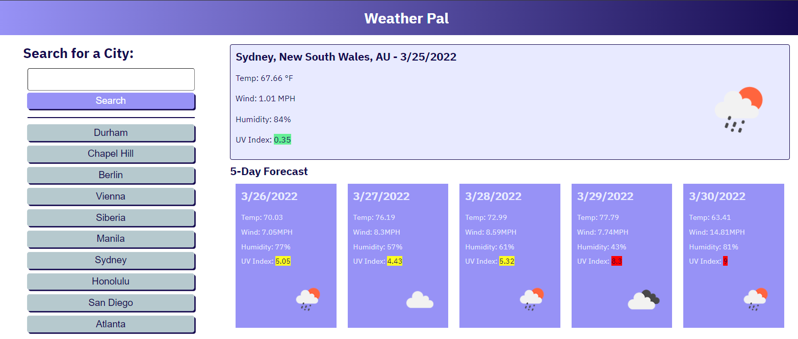

# weather-pal

Traveling soon? Use Weather Pal to help plan your trip! Weather Pal will give you a summary of the current weather and a 5-day forecast for any major city, containing:
* Date
* Temperature (degrees F)
* Wind Speed (mph)
* Humidity
* UV Index
* Icon representing the weather for the day

Type the name of any city in the search bar and hit enter or click "Search" to view a summary of the current weather in that city, as well as a 5-day forecast showing the temperature, wind speed, humidity, and UV index for each day.

UV index will be shaded depending on severity:

* 0 - 2.99: **Low** - Green
* 3 - 5.99: **Moderate** - Yellow
* 6 - 7.99: **High** - Orange
* 8 - 10.99: **Very High** - Red
* 11 or more: **Extreme** - Purple

The past 10 most recent unique and successful searches are displayed for easy access.

## Usage

* The app can be accessed at [https://chardmuffin.github.io/weather-pal/](https://chardmuffin.github.io/weather-pal/)

* Click on a previous search term to see that city's forecast.

## Resources

### Open Weather Map's Geocoding API

Open Weather Map's One Call API requires the longitude and latitude of the requested city. This information was received via Open Weather Map's Geocoding API.

For more information visit [https://openweathermap.org/api/geocoding-api](https://openweathermap.org/api/geocoding-api)

### Open Weather Map API

Open Weather Map's One Call API was utilized to get current weather data as well as future weather data including temperature, wind speed, humidity, and UV index.

For more information visit [https://openweathermap.org/api/one-call-api](https://openweathermap.org/api/one-call-api)

### UV Index

The UV Index ranges are based on the EPA's UV Index Scale: [https://19january2017snapshot.epa.gov/sunsafety/uv-index-scale-1_.html](https://19january2017snapshot.epa.gov/sunsafety/uv-index-scale-1_.html)